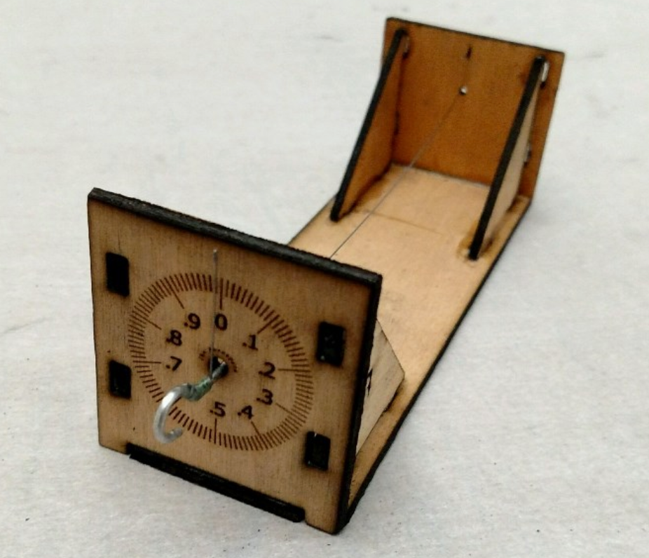
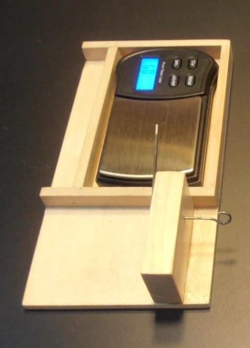

Digital Torque Meter
####################

To get started on my research I decided to get data on what powers my models -
a simple (well maybe not so simple) rubber band!

Indoor Rubber
*************

The rubber used for this kind of flying generally obtained from FAI Model
Supply, and is precisely cut to specified widths, then measured carefully to
some length and cut, then tied into a loop, and lubricated so it will wind and
unwind easier. This is something of an art.

That motor is wound up with specialized winders to some number of turns, often
in the thousands, or to some specified torque value. Winding is simple, and
adding a counter to the winder makes counting much easier. Measuring torque is
a bit harder and takes a measuring device known as a torque meter to get the
data.

Let's look closer at the typical torque meter.

Torque Meters
*************

The common torque meter, is a simple device. There is a short piece of music
wire, used as a torsion wire, firmly attached at one end of a metal tube or
attached to a wooden frame. The other end of the wire ends at a hook where the
rubber motor will be attached.  At that end, a second short piece of wire is
connected to the torsion wire at a 90 degree angle, and that short piece
becomes an indicator. As the motor is wound, the torque twists the torsion wire
causing the pointer to move in an arc. A dial is placed behind the pointer with
markings to let the user determine the torque at any moment. Here is a simple
one from J&H Aerospace:

Crude, but this kind of device has been a staple of indoor modeling for
decades.

A few enterprising builders have omitted the dial and placed a digital scale
under the pointer to create a digital torque meter.  Here is one I found on the
SciOly.org website which supports the Science Olympiad competitions. (There are
indoor model airplane events in that competition!)

This is easier to read, and simple to build, but still getting the data is a
manual process. What I wanted was a torque meter that could deliver its data
directly to a computer.

Microcontrollers to the Rescue
==============================

In part of my career I taught a college-level course in computer architecture,
and introduced students to modern microcontroller systems, popular in the world
of home automation and robotics. Since I have many such systems available, I
selected a Raspberry PI as the computer to drive my experiments. Wha I need is
a way to gather wind count and torque data for a rubber motoras it is wound,
then gather turn data (and ideally torque data as it unwinds as well. The
puzzle is how to take my standard flying tools and convince them to deliver the
data.

Obviously, I am not going to be able to get data from the model as it flies,
but some experiementers have constructed test gear to set up a motor and
propeller on the end of along arm to simulate flying. Perhaps there is
something there I can use in my test work.

Measuring wind counts.
----------------------

A common way to measure turns as a motor is wound is to use a mechanical or
magnetic device attached to the winder that delivers a count on some form of
digital meter. I should be easy to adapt this idea to something that can feed
dayta to the microcontroller. We will look at that in a following section.

The torque meter is a different problem entirely. The wire twists under torque,
and reading the twist is not an easy thing to do automatically, If I elect to
use the digital scale as my measuring device, I still need to dig into that
meter and find a way to connect it to the microcontroller.

Some builders have managed to pull the actual measuring device in the scale, a strain
gauge or "load cell" out, and get that connected to a microcontroller, but we
are still left with mechanically setting up a twisting wire so it pushes on the
load cell. That sounds like a lot of work!  What I need is some simple way to automate
the reading of the torque value from my meter.

In looking over my stash of microcontrollers, I found a Raspberry Pi camera
board that easily connects to the Pi. Perhaps I can convince the Pi to process
a camera view of the dial on a torque meter and give me a reading. Image
processing is getting pretty good these days, so it is worth a simple test to
see how this works.

Twist and Shout
***************

Bad pun for an old rocker!

Before we go further, lets look at the science of the twisting wire and see
what we are really doing.

The formula for the twist angle of a piece of music wire subjected to a torque
can be found from this formula:

..	math::

	\alpha = 536.5 \frac{Q l}{d^4 G}

Where:

	* **Q** is the applied torque (inch lbs)
	* **l** is the length of the wire (inches)
	* **d** is the diameter of the wire  (inches)
	* **G** is the modulus of elasticity for the wire (lb/in^2)

Here are some typical values for **G**:

..	csv-table::
	:header: diameter, G

	0-0.032, 12000000
	0.033-0.063, 11850000
	0.064-0.125, 11750000
	0.126-0.250, 11600000

To demonstrate using this math to figure out the twist angles to expect from my meter, let's generate some code.
